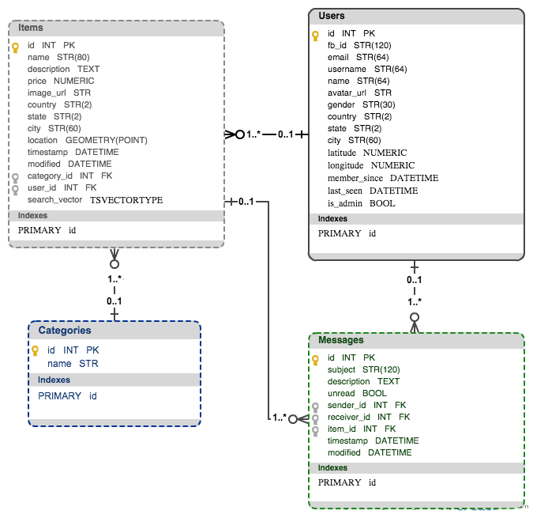

# Database 

Database model definition and a guide to check how to create a database, make a migration, ...

## Database model



Below I describe some interesting elements or relation from each of the tables: 

<h4>Users table</h4>
- Primary key: id
- Relationships:    
    - items:  
        - A query to the resource is returned when a user is loaded (``lazy='dynamic'``)  
        - When a user is deleted, all her items are also deleted (``cascade='all, delete-orphan'``)      
    - msgs_sent:  
        - A query to the resource is returned when a user is loaded (``lazy='dynamic'``)  
        - Specific relation: ``primaryjoin="User.id==Message.sender_id"``  
    - msgs_received:  
        - A query to the resource is returned when a user is loaded (``lazy='dynamic'``)  
        - Specific relation: ``primaryjoin="User.id==Message.receiver_id"``  
    - msgs_unread:  
        - Unread messages are loaded on demand the first time they are accessed (``lazy='select'``)  
        This is very important because we will be calling len(current_user.msg_unread) to display an "Unread notifications" icon in the NavBar (printed in each request when the user is logged in) so we need to make sure to not trigger a query each time we access the resource  
        - Specific relation: ``primaryjoin="and_(User.id==Message.receiver_id, Message.unread==True)"``  

<h4>Items table</h4>
- Primary key: id
- location:  
    Geometry point that represents a spatial coordinate from the [WGS84](http://en.wikipedia.org/wiki/World_Geodetic_System#WGS84) reference system. This is indicated by the spatial reference id value (srid=4326)
- search_vector:  
    TSVectorType column that vectorize the string columns name and description and create the search vectors.

<h4>Messages:</h4>
- Primary key: id
- Deletes for foreign keys: sender_id, receiver_id and item_id are set to ``ondelete='SET NULL'``, so if a user or item is deleted the message is still available.  


## Database creation  
In vagrant's config file [pg_config.sh](https://github.com/rosariomgomez/tradyfit/blob/master/vagrant/pg_config.sh#L9):  
```
su postgres -c 'createuser -dRS vagrant'
su vagrant -c 'createdb tradyfit_dev'
su vagrant -c 'createdb tradyfit_test'
```

The same can be achieved from the command line, run psql and create the dev and test databases:  
```
>> psql  
>> CREATE DATABASE tradyfit_dev;
>> CREATE DATABASE tradyfit_test;
```

<h3>How to add PostGIS support</h3>
[PostGIS](http://postgis.net/) adds support for geographic objects allowing location queries to be run in SQL. In vagrant's config file [pg_config.sh](https://github.com/rosariomgomez/tradyfit/blob/master/vagrant/pg_config.sh#L12) install the packages and create the extensions:  
```
sudo apt-get install postgis postgresql-9.3-postgis-2.1
sudo -u postgres psql -c "CREATE EXTENSION postgis; CREATE EXTENSION postgis_topology;" tradyfit_dev
sudo -u postgres psql -c "CREATE EXTENSION postgis; CREATE EXTENSION postgis_topology;" tradyfit_test
```

## Set up
Since the production app will be using a Postgres DB, it is a good idea to develop and test locally on the same database. In order to communicate the postgres database with the flask application, we need to use the following libraries: 

- [psycopg2](http://initd.org/psycopg/): Python adapter for Postgres  
- [sqlalchemy](http://www.sqlalchemy.org/): Python SQL and ORM (Object-relational mapping) framework.
- [flask-sqlalchemy](https://pythonhosted.org/Flask-SQLAlchemy/): Flask wrapper for SQLAlchemy that provides useful defaults and extra helpers.
- [Flask-Migrate](https://flask-migrate.readthedocs.org/en/latest/): Flask extension for SQLAlchemy database migrations (it makes use of Alembic)  
- [GeoAlchemy2](http://geoalchemy-2.readthedocs.org/en/latest/): allows SQLAlchemy's ORM to work with spatial databases (in our case PostgreSQL/PostGIS implemented for items table on location column that will allow us query for nearby points)   


## Model definition
Tables are defined in [models.py](https://github.com/rosariomgomez/tradyfit/blob/master/vagrant/tradyfit/app/models.py) classes that include directives (\_\_tablename\_\_) to describe the actual database table they will be mapped to.


## config.py
In the [config.py](https://github.com/rosariomgomez/tradyfit/blob/master/vagrant/tradyfit/config.py) file we specify the URI for the database we will be using depending on the environment the application is running.
Amongst other configurations, we specify:  
```SQLALCHEMY_COMMIT_ON_TEARDOWN = True```  
This will make automatic database commits at the end of each request we have modified the db.session.

## Run database operations from the shell
Thank you to the method make_shell_context() in [manage.py](https://github.com/rosariomgomez/tradyfit/blob/master/vagrant/tradyfit/manage.py#L20), we can query the database tables from the console using the SQLAlchemy syntax.  
Some examples:  
```
>> python manage.py shell
```    

- Adding default values to DB from file (such as sports categories):  
```
>> Category.insert_categories()
```  
- Querying rows:  
```
>> User.query.all()
>> user1 = User.query.filter_by(username='emily34').first()
``` 
- Deleting:
```
>> db.session.delete(user1)  
>> db.session.commit()
```  

## Migrations
Before database migrations can be maintained, it is necessary to create a migration repository with the init subcommand:   
```
>> python manage.py db init
```  
This command creates a migration folder, where all the migration scripts will be stored.  
  
Every time we make a change on the db schema, we need to run a db migration. We can use the db migrate subcommand that will generate an automatic migration script:  
```
>> python manage.py db migrate -m “change we’ve made on the database”
```  

Then, we should review the script to see if it was correctly generated. And finally we apply the change to the database with the db upgrade command:  
```
>> python manage.py db upgrade
```


