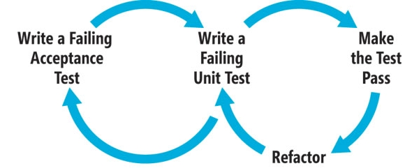

# Testing strategy

This section contains all the information about the tools, packages and strategy followed for testing the application.

## Behavior Driven Development
The idea of following BDD is to focus the test suite on the behavior of the application as a whole.
Writing first a test describing the feature's functionality before coding it, helps to understand on a higher level what are the expectations from a user point of view. The following diagram summarize the process:  



- I write the acceptance test as an integration test. After writing it, I write several unit tests that exercise the code at a granular level.
- Finally, with all the design in place, I write functional tests at a browser level. For doing this I created a testing framework by using the [Selenium WebDriver API](http://selenium.googlecode.com/git/docs/api/py/api.html) in conjunction with the unittest library.

## Unit tests
Test methods in isolation. Mock any external call to other methods.
  
## Integration tests  
Test feature functionality without browser interaction.  

Unit and integration test classes inherit from BasicTestCase, UnitTestCase or ClientTestCase defined on [base.py](https://github.com/rosariomgomez/tradyfit/blob/master/vagrant/tradyfit/tests/base.py)  

## Acceptance tests
Test feature functionality with browser interaction by using Selenium Webdriver with unittest framework.  
In order to not DRY, I created the following files:  
- [helper.py](https://github.com/rosariomgomez/tradyfit/blob/master/vagrant/tradyfit/tests/functional/helper.py) contains the necessary code to connect with the RemoteWebdriver server and launch our application in a thread.  
- [page.py](https://github.com/rosariomgomez/tradyfit/blob/master/vagrant/tradyfit/tests/functional/page.py) defines page objects. A page object represents an area in the web application UI that the test is interacting with (home page, item page...).  
- [locators.py](https://github.com/rosariomgomez/tradyfit/blob/master/vagrant/tradyfit/tests/functional/locators.py) define all the elements (and their locators) that the tests will be interacting with, so if we change the locator of an element, this is the only place where the change is needed.  

__Some notes:__  
  - Try to use id (#) and class (.) attributes for locators whenever is possible  
  - Use explicit waits to meet all browser requirements


## Continuous integration

<h3>Travis-CI</h3>
Any new changes on the source code (every time I push code to Github) will trigger a build. It creates a new virtual machine with the set up specified on the [.travis.yml](https://github.com/rosariomgomez/tradyfit/blob/master/.travis.yml) file: database, dependencies and the build commands; and then, it runs the tests (unit and integration).

- [Builds history](https://travis-ci.org/rosariomgomez/tradyfit/builds)

<h3>Coveralls</h3>
After the tests have finished on TravisCI, a code report is sent to coveralls. It provides a [dashboard](https://coveralls.io/r/rosariomgomez/tradyfit), where you can see the total coverage per build, see how it changes over time, and also you can browse each file to inspect what lines have been covered or are missing.

## Improving code quality

<h3>Code climate and Landscape</h3>
They provide a suite of static analysis tools that inspect the code complexity, look for code duplication, security issues, style and clarity.    
I use both tools because although there is some overlapping on the information they provide, there are some problems that appear only in one or the other.  

- [Code climate dashboard](https://codeclimate.com/github/rosariomgomez/tradyfit)
- [Landscape dashboard](https://landscape.io/github/rosariomgomez/tradyfit) 


## Notes
__Mocking:__  
- When mocking an imported method inside the function in test, we must ensure that we patch the name used by the system under test. __The basic principle is that you patch where an object is looked up, which is not necessarily the same place as where it is defined.__
- In order to unit test form validation for file uploading, I had to mock a file, by using the specifications from the FileStorage class. That was the only way I was able to pass the FileRequired validation [test_create_item_form](https://github.com/rosariomgomez/tradyfit/blob/master/vagrant/tradyfit/tests/unit/main/test_forms.py#L151)  
- To ensure a mock is being called, you can make use of the built in instance method from the Mock class ``assert_called_with()``. Example: 
```
mock_save_avatar.assert_called_with('http://test-image.png')
```
    
- More info in the [patch documentation](http://mock.readthedocs.org/en/latest/patch.html#where-to-patch).  

__Remove connection on tearDown:__  
If the connection is not removed, it stays idle. After running several tests (the error occurs to me when adding the 117 test case), sqlalchemy is using all the connections and an Operational error occur.  
I solved it by adding: ``db.get_engine(self.app).dispose()``  
Found solution [here](http://stackoverflow.com/questions/18291180/flask-unittest-and-sqlalchemy-using-all-connections)  
I confirmed it by checking the process running during test execution, and found several open connections in idle status:  
```
ps aux | grep tradyfit_test  
postgres 31101  [..]  postgres: vagrant tradyfit_test [local] idle
```
  
